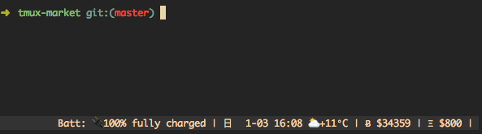

# Market plugin for tmux
[](https://opensource.org/licenses/MIT)

Shows market in the status line, data provided by [CoinMarketCap](https://coinmarketcap.com/)



## Installation
### Requirements
* curl
* jq

### With Tmux Plugin Manager
Add the plugin in `.tmux.conf`:
```
set -g @plugin '5cs/tmux-market'
```
Press `prefix + I` to fetch the plugin and source it. Done.

### Manual
Clone the repo somewhere. Add `run-shell` in the end of `.tmux.conf`:

```
run-shell PATH_TO_REPO/market.tmux
```
NOTE: this line should be placed after `set-option -g status-right ...`.

Press `prefix + :` and type `source-file ~/.tmux.conf`. Done.

## Usage
Add `#{market}` somewhere in the right status line:
```
set-option -g status-right "#{market}"
```
then you will see the current market in the status line: `Ƀ 33930`

## Customization
The plugin could be customized with:
* `set-option -g @tmux-market-interval 15` - Set up the update interval in minutes, by default it is 15 minutes.
* `set-option -g @tmux-market-api-key xxx` - Set up the crypto market api key, register from [CoinMarketCap](https://coinmarketcap.com/).
* `set-option -g @tmux-market-units" "USD"` - Set up market units (USD - for US dollar, CNY - for RMB yuan), by default used USD units.

## License
tmux-market plugin is released under the [MIT License](https://opensource.org/licenses/MIT).
